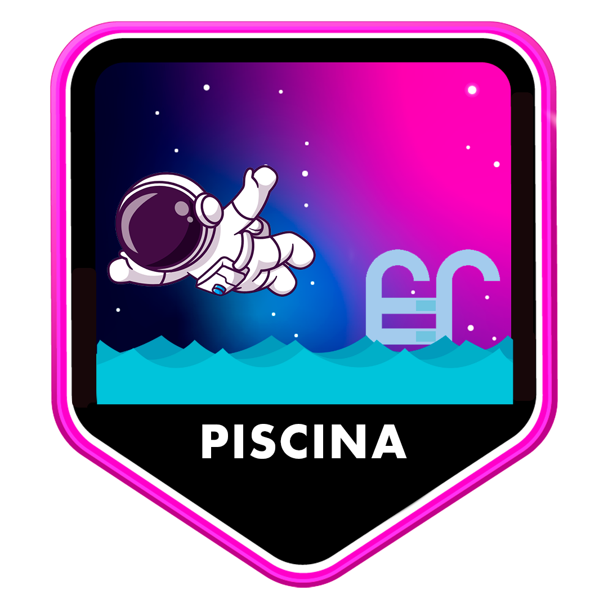

	
	
	

<h1>Hello,</h1>

  

<h2></h2>
	
 :computer: I'm Student from software engineering in @42sp school!

 :brazil: I’m from Brazil.

 :books: I’m currently learning everything.

 :outbox_tray: 2024 Goals: finish fundamentals trail at 42sp and find a new job.

---

### Programming and Markup Languages

---
<h3>GitHub Stats</h3> 
	
| | |
|--|--|
---

<h1 align="center"> :trophy: :four::two: Projects:</h1>
<h3 align="left"> :star2: Badgets:</h3>

