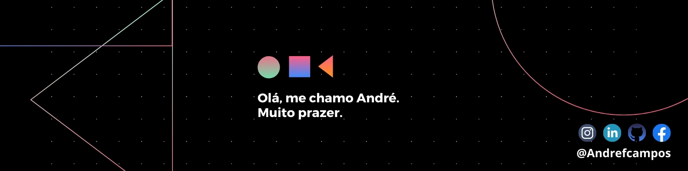

	
	
	

<h1>Hello,</h1>

  

	<h1 align="center">
		
		Projects
	</h1>

	
	

	<h4 align="center"> 
		
	</h4>
	
	 
	
	
	
	
	

	<h4 align="center">
		
	</h4>
	
	

	<h3>42 stats</h3> 
	

		
	

		<h3>
			
			<scan>Git stats
		</h3> 
		

			
			
		

	

		<h4>Languages:</h4>
		
		
		
	 		
	

	

		<h4>Tools:</h4>
		
		
		
	

